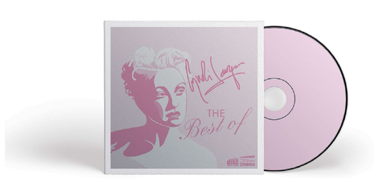

# Quelques réalisations

Au fil des années et de mes formations en production multimédia et en infographie, j'ai pu créer bien des documents ! Illustrations vectorielles, logos, mises en page et j'en passe !

En voici quelques unes.

## Illustrations vectorielles

### Illustration vectorielle d'une coccinelle et d'une tulipe sur Illustrator

### Illustration d'une pochette de CD, Cindy Lauper, sur Illustrator

## Logos et branding

### Logo et verso de carte de visite de Septra Magie et Voyance

### Logo du salon "Le plaisir de créer"

### Proposition de rebranding
Cette proposition de rebranding était destinée au service d'ortho-implant de la **clinique Le Mesnil**.

## Mises en page

### Pour Patrimoine Trois-Rivières

**Patrimoine Trois-Rivières** est une organisation à but non lucratif, qui promeut la culture matérielle et l'histoire de la ville de Trois-Rivières. Pour cette organisation, j'ai conçu leur image de marque, des affiches, deux magazines et une brochure détaillant le contenu des conférences du colloque de l'Association des Archéologues du Québec.

